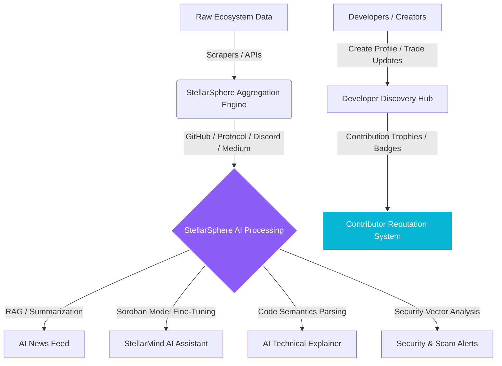

# 🌌 StellarSphere: AI-Powered Ecosystem Intelligence & Onboarding Platform

> **Grant Pitch:** *A next-generation AI-powered ecosystem intelligence, developer onboarding, and community hubs platform built specifically for the Stellar & Soroban network.*

---

## 📋 Executive Summary

StellarSphere is the central nervous system of the Stellar Development Foundation (SDF) ecosystem. Most blockchain networks suffer from fragmented communication—information is scattered across X (Twitter), Discord, Telegram, GitHub, Medium, forums, and developer documentation. For new builders, finding active hackathons, understanding technical Soroban releases, or discovering trustworthy projects is an uphill battle.

StellarSphere solves this by aggregating real-time ecosystem signals—GitHub commits, protocol upgrades, governance discussions, ecosystem blogs, grant programs, and developer tutorials—and using customized Artificial Intelligence (AI) models to translate this raw data into digestible, actionable intelligence. It combines an **AI-Powered News Feed**, an **Ecosystem Assistant**, a **Developer Discovery Hub**, an **AI Technical Explainer**, a **Contributor Reputation System**, and a **Security & Scam Alert System** into one cohesive, gamified ecosystem infrastructure.

---

## 🚨 The Fragmentation Problem

The Stellar ecosystem is expanding rapidly with **Soroban** smart contracts, but the developer and user experience is hindered by deep fragmentation:

1. **Scattered Intelligence:** Developers miss critical framework changes and security updates because they are spread across diverse communication channels.
2. **High Cognitive Load:** Technical proposals, contract specifications, and transaction mechanisms are difficult for beginners to digest quickly.
3. **Onboarding Friction:** New builders struggle to locate active projects to contribute to, apply for active grants, or find verified developer mentors.
4. **Scams & Trust Deficit:** Phishing links, malicious smart contracts, and fake projects target both developers and retail users, eroding trust within the network.
5. **No AI-First Hub:** There is no dedicated, intelligent ecosystem guide (a "ChatGPT for Stellar") equipped with real-time RAG (Retrieval-Augmented Generation) pipeline capabilities for Stellar and Soroban.

---

## 💡 The StellarSphere Solution

StellarSphere acts as an **ecosystem-wide intelligence layer** that simplifies discovering, building, and contributing to Stellar. It is NOT another standard social network; it is **critical onboarding infrastructure** that transforms chaotic noise into rich, developer-centric intelligence.



---

## 🛠️ Core Features

### 1. 📰 AI-Powered News Feed
Aggregates and organizes Stellar ecosystem telemetry: GitHub activity, protocol updates, Soroban releases, ecosystem announcements, developer blogs, hackathons, grants, and security advisories. 
* **Dynamic Translation:** AI summarizes everything into three customizable versions:
  * **Beginner-Friendly Update:** Focuses on *what* it means in plain English.
  * **Technical Breakdown:** Focuses on the *how*, highlighting contract code changes and architecture.
  * **Short Ecosystem Digest:** A bulleted, 30-second summary for quick consumption.

### 2. 🤖 AI Ecosystem Assistant ("StellarMind AI")
A RAG-powered chatbot fine-tuned on the Stellar Developer Documentation, Soroban Rust SDK, and community proposals. Users can ask:
* *"What changed in Soroban v21.2 this week?"*
* *"Explain how the token-receipt pattern works on Stellar."*
* *"Which active hackathons are looking for front-end developers?"*
* *"Give me a template for a multisig vault contract."*

### 3. 💼 Developer Discovery Hub
A showcase directory for Stellar projects (from early-stage wave program grantees to mature dApps). 
* **Collaborative Matching:** Projects create profiles, link GitHub repos, share milestones, and list "Open Bounty Issues" or "Contributors Wanted".
* **Onboarding Tunnel:** Allows new developers to instantly match with projects that fit their skill levels and interest areas.

### 4. 🧠 AI Technical Explainer
A visual playground for decompiling complex code. 
* **Interactive Rust/Soroban Explainer:** Paste a smart contract, transaction envelope, or XDR payload, and StellarSphere translates it line-by-line, creating interactive execution diagrams and architectural flows.

### 5. 🏆 Contributor Reputation System
A gamified dashboard rewarding positive ecosystem participation.
* **Earn XP and Trophies:** For writing developer tutorials, reporting bugs, helping newcomers in the AI assistant channel, or contributing to verified repositories.
* **On-Chain Badges:** Contribution milestones are mintable as verified, soulbound NFTs or on-chain attestations on Stellar to build a sovereign Web3 resume.

### 6. 🔍 Smart Ecosystem Search
A semantic search bar powered by vector databases that lets users find developer tools, tutorials, contracts, grant terms, and team profiles using conversational queries.

### 7. 🛡️ Security & Scam Alerts ("StellarGuard AI")
Real-time security analytics scanning ecosystem links, contracts, and transaction templates.
* **Proactive Scanning:** Automatically flags phishing URLs, malicious contract deployments, and suspicious wallet operations, ensuring a safe haven for beginners and veterans alike.

---

## 🔗 The Stellar Advantage (Blockchain Integration)

StellarSphere is built with the **Stellar SDK** and **Soroban** at its heart:
1. **Soroban Smart Contracts:** Powers the **Contributor Reputation System**. Attestations, XP checkpoints, and peer-to-peer developer tipping are handled via blazing-fast, low-fee smart contracts.
2. **Instant Micro-Tipping:** Integrated micro-tipping allowing developers to send XLM or stablecoins (e.g., USDC) to creators directly under an educational post or tutorial.
3. **Decentralized Profiles:** User profiles can link securely to Albedo, Freighter, or Rwallet, enabling sovereign identities across the entire platform.

---

## 🧠 Advanced AI Features (Next-Gen Integration)

To make StellarSphere uniquely grant-ready, we integrate advanced AI models:
* **AI Daily Ecosystem Digest:** Real-time synthesis of thousands of Discord threads, Github commits, and blogs into a singular daily overview.
* **AI Smart Contract Auditor:** Scans submitted Soroban code blocks in the Explainer and flags common vulnerability patterns (e.g., reentrancy, auth bypass, math overflows).
* **AI Community Moderator:** Automatically detects spam, malicious links, and bot behaviors in the open feed channels.
* **AI Grant Assistant:** Analyzes the builder's profile and project description to match them with active SDF grants (Wave program, SCF) and help structure their application draft.

---

## 💻 Tech Stack

* **Frontend:** React, Vite, TypeScript
* **Styling:** Premium Vanilla CSS (curated HSL palettes, glassmorphism, dynamic glowing micro-animations)
* **Backend:** Node.js, Express, TypeScript, WebSockets (for live feeds/alerts)
* **AI Layer:** OpenAI GPT-4o APIs, LangChain, Pinecone Vector Database (RAG pipeline), HuggingFace Transformers
* **Blockchain:** Soroban Rust SDK, Stellar SDK, Freighter Wallet Integration

---

## 🗺️ Development Roadmap: The MVP Approach

We focus on a lean, high-impact MVP focusing on core community and developer value before expanding into full decentralized scaling.

```
┌─────────────────────────────────┐
│     Phase 1: Foundation (MVP)   │
│ 🌟 AI Ecosystem Feed & Summaries│
│ 💬 StellarMind AI Assistant     │
│ 💼 Project Discovery Hub        │
│ 🏆 Basic Contributor Profiles   │
└────────────────┬────────────────┘
                 │
                 ▼
┌─────────────────────────────────┐
│    Phase 2: Technical & Security│
│ 🧠 AI Technical Explainer       │
│ 🛡️ StellarGuard Scam Monitor   │
│ 💎 P2P Wallet Tipping & Badges  │
└────────────────┬────────────────┘
                 │
                 ▼
┌─────────────────────────────────┐
│     Phase 3: Decentralization   │
│ 📜 Soroban Contributor Contracts│
│ 🌐 Sovereign Attestations       │
│ 🤝 SCF Grant Matching Engine    │
└─────────────────────────────────┘
```

---

*StellarSphere is not just a portal; it is the AI-powered intelligence layer accelerating the developer and user onboarding journey across the entire Stellar ecosystem.*
